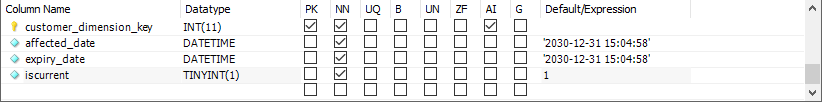

# SCD2-Implementation-Mandatory

```
  Use the attached Script provided as an example implementation of "Customer" table from OLTP to OLAP.

You're required to complete implementation of the same on Product Table and share Update Script along with Screenshot of working evidence

Try the Following Cases:
Insert a New Product and Run Script then Take screenshot of New Record in SCD2_Product_DIM
Update any ProductLine for any Product ID of your Choice and demonstrate Change record Captured in SCD2_Product_DIM
```

`sample code :ClassicModel_Customer_SCD2.ipynb`




`watchvideo`[click here]('https://www.youtube.com/watch?v=Oar-M4GeF8U')

